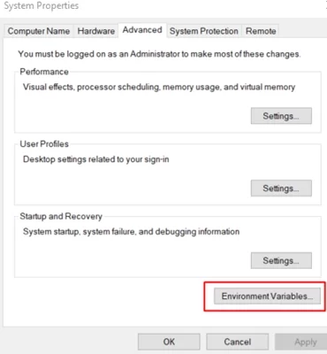
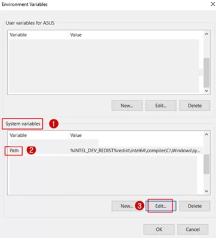
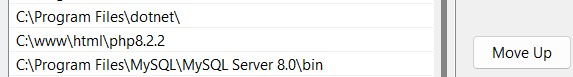
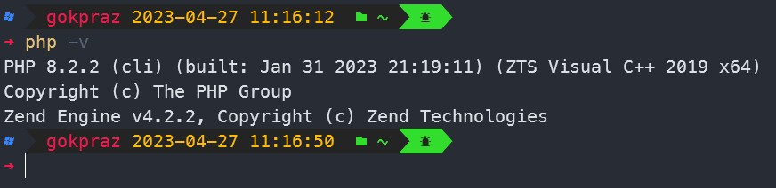

<div align="center">
   <h1>
      Cara mengubah versi php manual di Windows :sparkles:
   </h1>
   <small>
      Pada case percobaan ini mengubah dari versi <b>PHP7.4</b> ke versi <b>PHP8.2.2</b>
   </small>
</div>

### Requirement
- Sudah menginstall `Apache`, karena untuk percobaan ini menggunakan server apache
- Windows 11

### Langkah-langkah :moyai:

1. Download file versi php yang disesuaikan dengan kebutuhan
   > Untuk konfigurasi disesuaikan dengan kebutuhan masing-masing
2. Konfigurasi apache pada file `~/Apache24/conf/httpd.conf`, yang dimana disesuaikan versi PHP. berikut konfigurasi per versi. untuk penambahan script bisa ditambahkan di posisi paling bawah

   - PHP Version 7
		```console
		# Menambahkan PHP 7
		# LoadModule php7_module "C:\www\html\php7.4\php7apache2_4.dll"
		# PHPIniDir C:\www\html\php7.4

		LoadModule php7_module "posisi_lokasi_folder\php7apache2_4.dll"
		addHandler application/x-httpd-php .php
		PHPIniDir posisi_lokasi_folder\php7.4
		```
   - PHP Version 8
		```console
		# Menambahkan PHP 8
		# LoadModule php_module "C:\www\html\php8.2.2\php8apache2_4.dll"
		# PHPIniDir C:\www\html\php8.2.2

		LoadModule php_module "posisi_lokasi_folder\php8apache2_4.dll"
		addHandler application/x-httpd-php .php
		PHPIniDir posisi_lokasi_folder\php8.2.2
		```

3. Jika perubahan selesai, maka setelah itu restart service server `Apache2.4`. Untuk restart dapat menggunakan CLI ataupun Service, pada case ini menggunakan restart manual menggunakan service :
   - Ketik `windows + r` dan ketik `services.msc`. kemudian pilih `Apache2.4` klik kanan & pilih restart

4. Jika sudah selesai, dapat di check dengan cara `localhost` jika sukses maka versi terbaru sudah terinstall di server, akan tetapi untuk versi CLI belum 

5. Setelah selesai, selanjutnya adalah mengatur `Environtment Variables` dari control panel


6. Setelah itu pada `System Variables` > `Path` kemudian edit


7. Kemudian menambahkan path file & folder PHP pada environtment, `C:\www\html\php8.2.2`
	> Untuk lokasi disesuaikan dengan lokasi komputer masing-masing



8. Setelah sukses maka versi terbaru sudah terupdate


